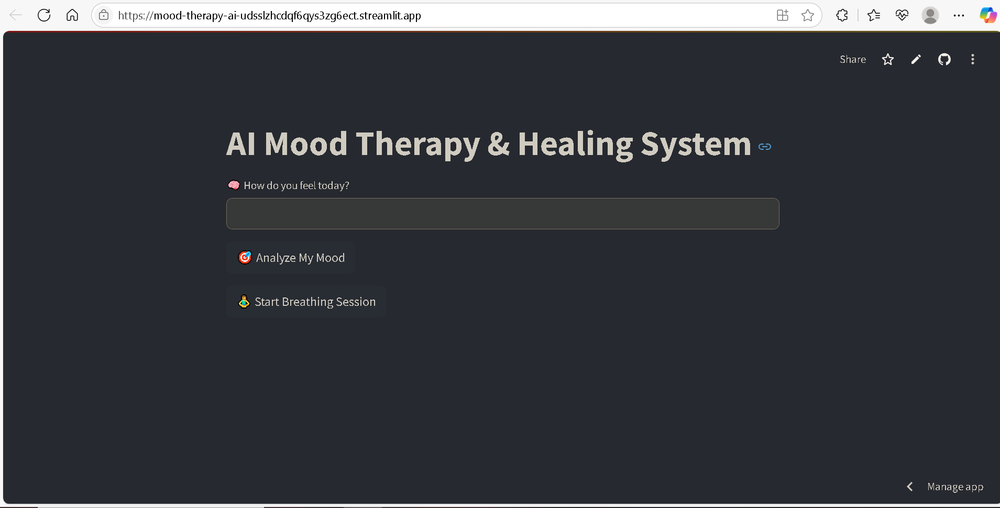

#  AI Mood Therapy & Healing System

> A personalized AI companion that helps users reflect, heal, and calm down by detecting mood from text and offering calming music, motivational quotes, and breathing exercises.

[](https://mood-therapy-ai-udsslzhcdqf6qys3zg6ect.streamlit.app/)

---

## 🖼️ Preview

  


---

## 💡 Features

- 🧠 **NLP Mood Detection** using Hugging Face emotion model  
- 💬 **Personalized Calming Quotes** based on emotional state  
- 🎵 **Healing Music Recommender** from public YouTube links  
- 🧘 **Breathing Exercise UI** with 4-4-4 cycle  
- 📊 **Mood Trend Dashboard** using Streamlit + Altair  
- 📁 **Mood Log CSV** to track emotional history over time

---

## 🛠️ Tech Stack

- Python  
- Streamlit  
- Hugging Face Transformers  
- Altair  
- Pandas  

---

## 🙏 Credits
- Hugging Face: Emotion Detection
- YouTube: Calming Music
- Streamlit: App UI

---

## 👤 Author
**tanizhan**  
-GitHub: [@tanizhan64](https://github.com/tanizhan64) 

-Hugging Face: [@tanizhan](https://huggingface.co/tanizhan)


---

## 🚀 How to Run Locally

```bash
git clone https://github.com/tanizhan64/mood-therapy-ai.git
cd mood-therapy-ai
pip install -r requirements.txt
streamlit run streamlit_app.py
